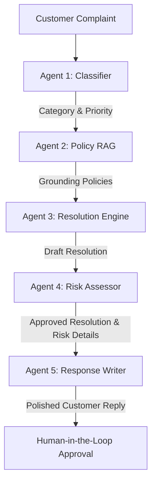

# ⚡ SmartResolve AI

A lightweight, multi-agent RAG (Retrieval-Augmented Generation) system for automated customer support ticket resolution. Five specialized AI agents work in a pipeline to classify complaints, retrieve relevant company policy rules, generate resolutions, assess risks, and draft customer replies—all fully grounded in company policy documents.

Optimized to run seamlessly on resource-constrained hosting (e.g., Render's free tier) by utilizing a lightweight TF-IDF retrieval system (under 50MB RAM).

---

## 🏗️ Architecture



### The 5-Agent Pipeline
1. **Agent 1 \| Classifier (`classify_ticket`)**: Categorizes the ticket (e.g., Billing, Delivery, Technical), extracts a summary, and calculates priority.
2. **Agent 2 \| Policy RAG (`get_relevant_policy`)**: Performs keyword-based TF-IDF search over company policies to find matching rules.
3. **Agent 3 \| Resolution Engine (`generate_resolution`)**: Drafts a solution step-by-step, fully grounded in the retrieved policies.
4. **Agent 4 \| Risk Assessor (`check_risk`)**: Audits the resolution for legal/financial liabilities, assigns a risk score (0-100), and flags for escalation if needed.
5. **Agent 5 \| Response Writer (`write_customer_reply`)**: Drafts a polite, professional response to the customer incorporating the resolution.

---

## 🛠️ Tech Stack

- **Backend**: FastAPI, Uvicorn, Python 3.11+
- **LLM Engine**: Groq API (`llama-3.1-8b-instant`)
- **RAG Engine**: Lightweight, customized pure-Python TF-IDF vectorizer + Cosine Similarity (`numpy`)
- **Database**: SQLite3
- **Frontend**: Premium dashboard with Chart.js, HTML5, Vanilla CSS, and JS

---

## 🚀 Local Setup

### 1. Clone the Repository
```bash
git clone https://github.com/sapeksh98/smartresolve-ai.git
cd smartresolve-ai
```

### 2. Set Up a Virtual Environment
```bash
# Windows
python -m venv venv
venv\Scripts\activate

# Linux/macOS
python3 -m venv venv
source venv/bin/activate
```

### 3. Install Dependencies
```bash
pip install -r requirements.txt
```

### 4. Configure Environment Variables
Create a `.env` file in the root directory:
```env
GROQ_API_KEY=your_groq_api_key_here
ADMIN_PASSWORD=admin123
```
> Get a free Groq API key at [console.groq.com](https://console.groq.com).

### 5. Initialize Policy Knowledge Base
Place your policy rules or text document at:
```
data/company_policies.txt
```
The search engine index will automatically compile and save to `data/tfidf_index.pkl` on the first run or when updated.

### 6. Run the Application
```bash
uvicorn main:app --reload
```
Open **`http://localhost:8000`** in your browser to view the customer interface. Go to **`http://localhost:8000/admin`** to log in to the administrator dashboard.

---

## 🔌 API Endpoints

| Method | Endpoint | Auth Required | Description |
| :--- | :--- | :---: | :--- |
| **GET** | `/` | — | Customer submission page |
| **POST** | `/resolve` | — | Processes complaints through the 5-agent pipeline |
| **GET** | `/tickets` | — | Lists all processed tickets |
| **GET** | `/analytics` | — | Returns aggregate statistics |
| **GET** | `/admin` | Basic Auth | Administrator dashboard panel |
| **GET** | `/admin/data` | Basic Auth | Admin statistics and ticket listings |
| **POST** | `/admin/upload-policy` | Basic Auth | Upload new policy file and rebuild search index |
| **POST** | `/rebuild-index` | Basic Auth | Manually rebuild the TF-IDF search index |

### `POST /resolve` Example

#### Request:
```json
{
  "complaint": "its already been 100 days since i ordered my laptop"
}
```

#### Response:
```json
{
  "complaint": "its already been 100 days since i ordered my laptop",
  "category": "DELIVERY",
  "priority": "HIGH",
  "summary": "Delay in order receipt, exceeds expected delivery time",
  "confidence": 0.85,
  "relevant_policy": "• Standard delivery time is 1-2 business days (max 3 days)...",
  "resolution": "RESOLUTION: Investigate order and expedite courier delivery...",
  "risk_level": "HIGH",
  "risk_score": 90,
  "risk_reason": "Extreme delay violates standard delivery policy, risking legal threat or chargeback.",
  "recommendation": "Escalate to logistics team for instant tracking and customer outreach.",
  "should_escalate": true,
  "customer_reply": "Dear Customer, we apologize for the unacceptable delay...",
  "latency_ms": 2450
}
```

---

## 📊 Administrator Panel

Access the dashboard at `/admin` (Default Credentials: User: `admin`, Password: your configured `ADMIN_PASSWORD`).

Features:
- **Live Metrics**: Real-time stats on total tickets, high-risk flags, manual escalations, and average latency.
- **Ticket Audit Log**: Searchable logs showing priority levels, computed risk scores, and latency.
- **Escalation Center**: Quick filter for tickets marked for immediate human intervention.
- **Policy Manager**: Drop-zone interface to upload new policies (`.pdf` or `.txt`) which automatically parses documents and rebuilds the vector index.

---

## ☁️ Deploying to Render

This repository is pre-configured for one-click deployments to Render.

1. Connect your repository on Render as a **Web Service**.
2. Render will automatically parse the `render.yaml` configuration.
3. Configure the following **Environment Variables** in the Render settings:
   - `GROQ_API_KEY`: Your Groq platform API key.
   - `ADMIN_PASSWORD`: Custom basic auth password for `/admin`.
4. Deploy the service. The service uses a persistent disk mount to persist the SQLite database and TF-IDF search index across service restarts.
